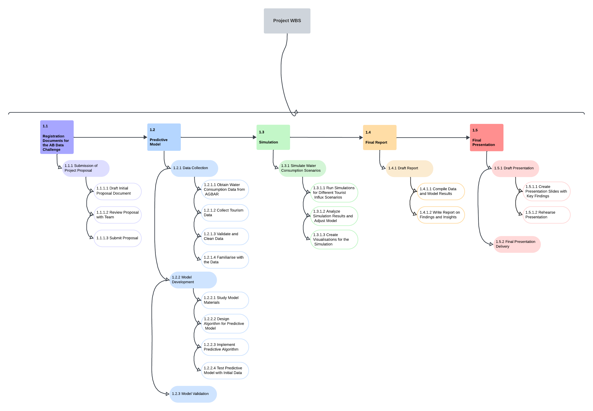

# ProjectManagement

### Project Core Team T101.A (alphabetical order)

|Name | Email | Role |
| --- | --- | --- |
| Ivan Hernández | ivan.hernandez04@estudiant.upf.edu | Technical Responsible |
| Bruno Manzano | bruno.manzano01@estudiant.upf.edu | Audiovisual Responsible |
| Paula Mateos | paula.mateos01@estudiant.upf.edu | Project Manager |
| Martí Oms | marti.oms01@estudiant.upf.edu | Creative Responsible |
| Yuyan Wang | yuyan.wang01@estudiant.upf.edu | Implementation Responsible |

### Disclaimer

This document and all content within are proprietary to Project Core Team T101.A and are intended solely for the use of authorized individuals within the project. Unauthorized sharing, copying, or use of this document, in whole or in part, is prohibited without explicit consent from the Project Core Team T101.A.

### How to Run the Notebooks

# AFEGIR LES DUES OPCIONS DE COM CORRER EL CODI (PER WINDOWS, LINUX I MACOS): 
 ## 1- DEMO NOTEBOOK AMB TOT.
 ## 2- .PY AMB EL CODI BEN ESTRUCTURAT (QUAN ESTIGUI FET)

This has been proven to be working on MacOS.

0. The recommended approach would be to create a Python3 virtual environment and activate it; however it is not essentially needed. Skip to next step if you don't want to use a venv.

    ```
    $ python -m venv <nameVenv>
    $ source <youPathToVenvActivate:e.g.nameVenv/bin/activate>
    ```

1. Install the necessary packages. We are providing the requirements.txt file.

    ```
    $ pip install -r requirements.txt
    ```

2. Use the corresponding Python3 as the Jupyter Notebook Kernel.
3. And you would be ready to go :)

### How to run the report on jupyter directlly

With the following command a jupyter tab will open on the default search engine.

```
    $ jupyter-lab&
```


## 1. Introduction

### Project Proposal

Aigües Barcelona Data Challenge 

The project “Anàlisi de la petjada hídrica dels turistes a Barcelona” aims to meticulously analyse the water footprint of tourists in Barcelona.

The project addresses the increasing demand for water due to mass tourism in Barcelona, with a focus on the commercial sector. The growing number of tourists—8.27 million in 2023, in contrast to the city’s 1.62 million residents—places a significant burden on the city's water resources, potentially accounting for up to 15.68% of the daily water consumption.

Given this pressure, especially during peak tourist seasons when the city's population nearly doubles, this project seeks to analyse the water footprint linked to tourism. By leveraging historical data and external variables, the team will develop a predictive model capable of forecasting water demand fluctuations. The results will provide actionable insights and recommendations for AGBAR to optimise water management, ensuring that Barcelona can sustainably meet the needs of both residents and tourists.

This collaboration with AGBAR aligns with our goal of applying data science and engineering skills to real-world challenges, particularly in managing critical urban resources like water. The outcomes of this project will contribute to the city's long-term sustainability and resilience in the face of growing tourism.

The deliverables related with this project is defined in this following image:



## 2. Data Processing:

El projecte parteix del dataset **daily_dataset.csv** proporcionat per AGBAR, que inclou dades detallades sobre el consum d’aigua a nivell diari i per secció censal. Aquest dataset constitueix la base principal del nostre model i conté els camps següents:  
- **Secció censal, districte i municipi**: per identificar zones geogràfiques concretes de consum.  
- **Data**: per analitzar la distribució temporal del consum d’aigua.  
- **Ús**: que especifica si l’aigua és utilitzada per a fins domèstics, industrials, comercials, o altres.  
- **Nombre de comptadors**: que indica quants dispositius registren el consum a cada secció.  
- **Consum acumulat (L/dia)**: volum d’aigua consumit diàriament en litres.  

Aquestes dades són indispensables per entendre la variabilitat del consum en funció de la geografia i del tipus d’ús. Tanmateix, per desenvolupar un model que integri els efectes del turisme i d’altres factors externs, necessitem ampliar aquesta informació amb noves fonts de dades:  

1. **Dades meteorològiques**:  
   - **Temperatura màxima i mínima diària**: el clima influeix directament en el consum d’aigua. Per exemple, en dies de calor intensa, el consum augmenta, especialment a zones turístiques amb activitats a l’aire lliure.  
   - **Precipitacions acumulades**: els dies de pluja redueixen el consum d’aigua en activitats a l’exterior, com el reg o les dutxes a platges i piscines.  

   Aquestes dades són crucials per ajustar el model als patrons estacionals i climàtics, que tenen un gran impacte en el consum d’aigua.  

2. **Dades de turisme**:  
   - **Pernoctacions diàries**: necessitem saber quants turistes s’allotgen a la ciutat cada dia. Aquesta informació reflecteix l'impacte del turisme en zones concretes i ajuda a identificar com els fluxos de visitants contribueixen al consum d’aigua en serveis com hotels, restaurants i activitats recreatives.  

   El turisme és un dels factors principals que volem analitzar. Per això, aquestes dades són essencials per segmentar el consum d’aigua atribuïble als visitants, diferenciant-lo del consum residencial o d'altres usos.  

La integració d’aquestes dades ens permetrà desenvolupar un model predictiu que connecti el consum d’aigua amb variables climàtiques i turístiques, oferint prediccions més precises i útils per a la gestió sostenible dels recursos hídrics. Així, podrem respondre preguntes clau, com l’impacte específic del turisme en zones determinades o l’efecte de condicions meteorològiques extremes en el consum global.   

Per més informació: [extracció_dades](/extracció_dades)

## 3. Model
  # TO DO


## 4. Simulació
 # TO DO
 Per més informació: [Simulació](/display)


## 5. Altres


**Control Information**
* Version: 1.1
* Date of Issue: 19 November 2024
* Responsible Party: Yuyan Wang (Implementation Responsible)
* Approval Status: Internal Use Only
* Access Permissions: Restricted to Project Core Team T101.A and approved collaborators

**Data sources**
 - gencat_turism: Generalitat de Catalunya.
   https://empresa.gencat.cat/ca/treb_ambits_actuacio/turisme/coneixement_planificacio/estadistiques-turistiques/index.html
   https://empresa.gencat.cat/web/.content/001-departament/04-serveis/04_estudis_estadistica/Turisme/Demanda-turistica/Turisme-estranger-Frontur/evolucio_frontur.xlsx
 - temperature_precipitation: API de AEMET.
   https://www.aemet.es/ca/portada
 - tourism_flux: Eurocontrol
   https://www.eurocontrol.int/Economics
 - https://github.com/martgnz/bcn-geodata/blob/master/seccio-censal/seccio-censal.geojson
 - Oficina Municipal de Dades: Ajuntament de Barcelona.
   https://dades.ajuntament.barcelona.cat/consum-privat/index.Rmd


### Structure of the data folder

We assume that the data folder looks like:

```
data/
├── census_geo.geojson
├── districts_geo.geojson
├── gencat_turism.xlsx
├── pernoctacons_2019_2024.csv
├── temperature_precipitation.csv
├── tourism_flux.csv
├── tourism_temp_bcn.csv
├── targetes_preprocessed.csv  # generated after running targetes.ipynb or downloading from git
├── dataset_targetes.csv
├── total_transacions.csv
└── local_data/  # this folder will not be in the repo for sizing issues
    ├── daily_dataset.csv
    └── old/
        ├── dades_datachallenge.csv
        ├── daily_dataset_economic_activity.csv
    └── merged_cleaned_data.csv  # generated after running data_processing.ipynb
```
