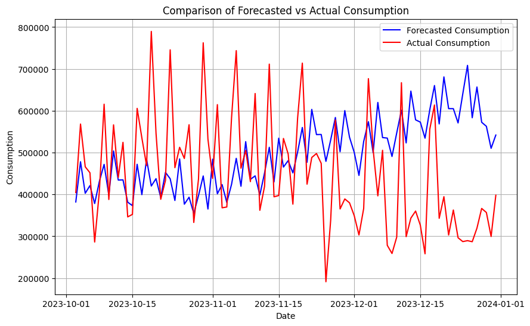

## 3.1 Investigació Previa

La nostra recerca inicial es va centrar en l’anàlisi de sèries temporals, identificada com el component fonamental per a l’entrenament de models adaptats a les especificacions del nostre projecte. L’anàlisi de sèries temporals és particularment efectiva amb dades seriades que inclouen un component temporal; en aquest cas concret, organitzat diàriament. Aquest camp es divideix àmpliament en dues categories principals: tècniques de previsió de sèries temporals tradicionals i models moderns d’aprenentatge automàtic. La distinció principal entre aquests enfocaments rau en els seus mètodes i capacitats. Les tècniques tradicionals, com ARIMA i l’alissat exponencial (exponential smoothing), generalment es basen en fonaments estadístics per modelar les dades de manera lineal i són més adequades per a dades amb tendències clares i consistents i estacionalitat. D’altra banda, els models d’aprenentatge automàtic, incloent els random forests i les neural networks, ofereixen un enfocament més flexible capaç de capturar patrons no lineals complexos a través de l’ús d’algoritmes que aprenen de les dades, fent-los adequats per a sèries més volàtils amb estructures subjaents complexes.

Vam començar explorant models potencials adequats per als requisits específics del nostre projecte amb el model Seasonal AutoRegressive Integrated Moving Average (SARIMA), una variant de l’ARIMA que incorpora un component estacional per abordar les fluctuacions periòdiques. El model SARIMA és efectiu amb conjunts de dades més simples; però sovint té dificultats amb estructures de dades més complexes. Durant la nostra anàlisi, vam observar diversos resultats que van guiar el nostre procés de decisió. Els gràfics de diagnòstic, en particular el gràfic de residus i el gràfic Q-Q normal, van demostrar un ajust raonable, amb residus que no mostraven patrons discernibles i s’alineaven amb la distribució normal. No obstant això, els resultats del test de Ljung-Box, que no va mostrar autocorrelació significativa, juntament amb l’heteroscedasticitat alta observada, van indicar una variabilitat inconsistent en els errors del model a través de la sèrie temporal, suggerint una captura incompleta de la dinàmica del conjunt de dades. A més, una limitació significativa del model SARIMA és la necessitat de formar un model diferent de manera independent per a cada secció de cens o districte, i requereix coneixement previ sobre la selecció de l’ordre millor i l’ordre estacional dels paràmetres del model. Aquests factors combinats ens van portar a considerar enfocaments de modelatge alternatius que podrien acomodar més efectivament les complexitats inherents al nostre conjunt de dades divers.

Després dels nostres experiments inicials amb el model SARIMA, vam explorar l’ús del model Prophet de Facebook, conegut per la seva robusta gestió de dades de sèries temporals que mostren patrons estacionals forts i tendències irregulars. Prophet està dissenyat per incorporar fàcilment canvis en les tendències i els efectes estacionals, fent que inicialment semblés una eina prometedora per al nostre conjunt de dades, que implica dinàmiques complexes com el consum diari d’aigua i la variabilitat deguda a factors externs. Malgrat les capacitats de Prophet amb dades numèriques i el seu enfocament per modelar fluctuacions estacionals, les nostres avaluacions van indicar que el seu rendiment no era òptim per a les necessitats del nostre projecte. En les proves que implicaven prediccions de dades dins de la mostra, mentre que Prophet era capaç de generar previsions, els nivells d’exactitud no van complir amb les nostres expectatives. El gràfic de diagnòstic va destacar discrepàncies entre els valors predits i els punts de dades reals, suggerint que el model potser no captura tots els patrons subjacents de manera efectiva.

Les limitacions dels models explorats anteriorment provenien de la seva incapacitat per comptar amb la jerarquia relacional entre diferents districtes o seccions de cens, ja que estan dissenyats per manejar només una sèries única a la vegada. Per abordar millor les subtilitats estructurals del nostre conjunt de dades, que organitza les dades jeràrquicament, vam recórrer a un enfocament de previsió de sèries temporals jeràrquiques. Específicament, vam utilitzar un HTSRegressor, utilitzant un model SARIMAX com a motor de predicció subjacent. Aquesta elecció va estar motivada per l’aptitud de l’HTSRegressor per alinear-se estructural i lògicament amb la natura jeràrquica de les nostres dades, prometent una anàlisi més conscient del context. No obstant això, mentre l’HTSRegressor gestiona hàbilment la composició jeràrquica del conjunt de dades, roman com un model univariat, que prediu principalment el Consum Acumulat basat únicament en dades de consum anteriors. Aquest model no incorpora inherentment variables exògenes com el nombre de turistes o les condicions meteorològiques, que són clau per a previsions matissades en el nostre context. No obstant això, el potencial per integrar aquestes dades addicionals a l’HTSRegressor existeix i podria millorar significativament l’exactitud de les seves prediccions. Un inconvenient notable que vam trobar amb aquest model va ser la seva ocasiónal predicción de valors negatius per al consum, un resultat que és impracticable per als nostres propòsits.

Fins a aquest punt, els models que havíem explorat eren predominantment univariats, dissenyats per analitzar i predir basats en una sola sèrie de dades a la vegada. Aquest enfocament, tot i ser útil, pot no complir completament amb els requisits del nostre modelatge predictiu, especialment quan múltiples variables interrelacionades influeixen en el resultat. En conseqüència, vam canviar el nostre enfocament cap als models de Vector Autoregressió (VAR), que són inherentment multivariats i capaços de capturar les relacions entre diverses sèries temporals simultàniament. Vam implementar models VAR individualment per a cada districte o secció censal, permetent que el model prevegi valors futurs de manera autònoma sense la necessitat de configurar manualment els paràmetres. Tot i que les prediccions inicials van produir un marge d’error considerable, reconeixem el potencial substancial del model VAR per refinar i millorar les seves prediccions amb un conjunt de dades més extens. Les discussions detallades sobre les aplicacions específiques i el rendiment del model VAR seran exposades en altres seccions d’aquest document.

En la nostra recerca de models predictius efectius, també vam provar tècniques d’aprenentatge automàtic: Random Forest i Gradient Boosting, específicament utilitzant l’algoritme CatBoost. Aquests models van servir per establir una línia base de rendiment. Tot i que ambdós models van mostrar un rendiment global similar, CatBoost es particularment adequat per manejar conjunts de dades amb una proporció més alta de variables categòriques, com els identificadors de districte i secció de cens del nostre conjunt de dades. Aquest avantatge és degut a la capacitat inherent de CatBoost per processar dades categòriques directament, reduint així la necessitat d’un extens preprocés. Malgrat els seus avantatges teòrics, ambdós models van produir un Error Quadràtic Mitjà (MSE) d’aproximadament 19.635 milions, que indica un rendiment subòptim per a la nostra aplicació específica.

Donades les limitacions observades amb els models estadístics tradicionals i els models d’aprenentatge automàtic inicials, vam decidir avançar la nostra exploració en tecnologies de deep learning, específicament centrant-nos en un model de Long Short Term Memory (LSTM). Aquest model representa el nostre enfocament final per a la fase de simulació del nostre projecte. Les LSTMs són particularment hàbils en el maneig de dades de sèries temporals degut a la seva capacitat de recordar informació durant llargs períodes, la qual cosa és crucial per predir seqüències amb dependències temporals. Una discussió exhaustiva d’aquest model final, incloent la seva arquitectura, procés d’entrenament i aplicació específica al nostre conjunt de dades, serà proporcionada en les seccions següents.

## Escalabilitat del model
